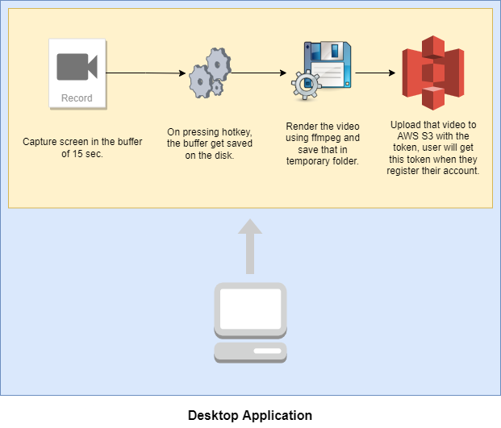

 

<h3 align="center">GMoments</h3>

---

 <i>Share your Unbelievable shots</i>
      

## 📝 Table of Contents

- [About](#about)
- [Features](#features)
- [Deployment](#deployment)
- [Application Flow](#application_flow)
- [Built Using](#built_using)
- [Authors](#authors)
- [Acknowledgments](#acknowledgement)

## 🧐 About 

GMoments saves your last few seconds (15-20 sec) gameplay and uploads the clip to your account. You can share this clip with your friends or just keep the clips for memories.

## 🤖 Features 

- Capture screen using Window Desktop Duplication API which is the faster method to capture the screen in windows.
- Render the video from 360 frames at 18-24 fps at the native resolution of display adapter.
- Supports hotkeys for rendering the video without minimizing the game window.

## 🚀 Deployment 

[Preview](/)

### Demo GIF

## 🗯 Application Flow 

### **For web interface:**

We will be having a website where register/non-register user can view the clips. User can register himself in order to upload the clips from desktop client to the web.
User will recieve a token similar to JWT token which will be a self contained token containing the required information about the user.

## ⛏️ Built Using 

- Client - Python, [D3DShot (Window Desktop Duplication API)](https://github.com/SerpentAI/d3dshot), [ffmpeg](https://github.com/kkroening/ffmpeg-python)
- Frontend - Javascript, [Nuxt](https://github.com/nuxt/nuxt.js), [Vuetify](https://github.com/vuetifyjs/vuetify)
- Backend - Java, Spring boot, MongoDB Atlas, Amazon S3, AWS Lambda

## ✍️ Authors 

- [@CryptoSingh1337](https://github.com/CryptoSingh1337) - Idea & Initial work

## 🎉 Acknowledgements 

- Inspiration: Glip
- Stack Overflow (Bugs are the part of Development process😀)
